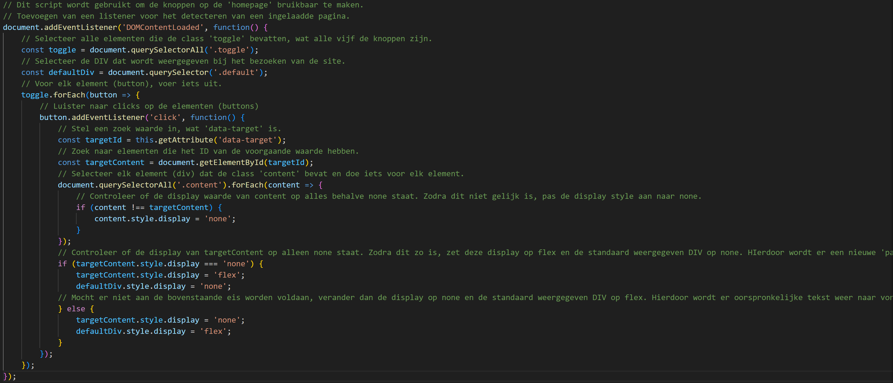

# Web App From Scratch @cmda-minor-web 2023 - 2024

Auteur/Student: Ferhat Kool
Studie: HBO-ICT: Cyber Security Specialist
Minor: Web Design & Development 

## Wat is de site?
De site is een one-page, persoonlijk portfolio, met daarin informatie over mijzelf (about me), mijn muziek (afspeellijsten en geproduceerde nummers), mijn hobbies, de groepsopdracht (heroes & villains) en de blog voor de weekly nerd. Alles past op één pagina, doordat iedere 'pagina' geopend dient te worden door op een knop te drukken.

## Wat is de groepsopdracht?
Voor de groepsopdracht is een persoonlijke top vijf lijst gemaakt met daarin de vijf favoriete heroes (helden) en vijf favoriete villains (slechterikken). De informatie van deze top vijf komt uit een persoonlijk JSON bestand. Bij de groepsopdracht wordt de JSON file van ieder teamlid gebruikt om een gezamelijke lijst te maken waarin kan worden gefilterd op enkele waardes.

## Wat is de blog?
De blog wordt gebruikt om de weekly nerd (een wekelijke gastspreker) bij te houden. Hierin komen onderdelen te staan, zoals van elke spreker een verslag van de onderwerpen, tools, voorbeelden, ideeën ... die voor mij belangrijk zijn, de uitkomst van de Hackaton met daarbij mijn inbreng en nieuwe opgedane inzichten en voor elke weekly Nerd gesprek een reflectie en blik op de toekomst. Er zullen drie momenten zijn waarvoor een blogpost gemaakt moet worden. Dit zijn momenten waarin ik als student gesprekken hou met een coach/docent over mijn plannen, mijn leerdoelen voor de meesterproef en een reflectie & vervolg gesprek.

## Logs
### 06-02-2024
Wat heb ik gedaan?

- WireFrame gemaakt voor de site in Adobe XD.
- Basic HTML en CSS styling toegepast op de site, o.a. de styling van de knoppen op de pagina en heb enkele root waardes ingesteld voor de gehele site, zoals een font voor de h1 en h2 tags.
- Fetch() toegevoegd aan de site om data uit een JSON file op te halen. Enkele waardes worden ook toegepast op de site.
- De functionaliteit om voor elk verschillende knop een andere inhoud te hebben toegevoegd; er zijn vijf knoppen die ieder een eigen ‘pagina’ tonen op de ‘homepage’. Hiervoor is een apart script voor gemaakt.
- Begonnen met het leren van “display: flex” a.d.h.v. https://css-tricks.com/snippets/css/a-guide-to-flexbox/. Vervolgens elk element deze display gegeven.
- De muziek pagina aangevuld met drie playlist widgets van Spotify (iFrame) en twee geproduceerde tracks toegevoegd. De source van elke track wordt opgevraagd uit het JSON file, waarbij er per track een array is ingevuld met daarin de titel en locatie van de track. Deze wordt a.d.h.v. [naam variable].src ingevuld, waarna een andere functie de audio tag reload.
- fetch.js van commentaar voorzien.
- [README.md](http://README.md) aangemaakt en begonnen met invullen.

Bronnen: 

- https://css-tricks.com/snippets/css/a-guide-to-flexbox/
- ChatGPT:
    - Can you write me a JavaScript code to change the display style of a div with the classname "content" when a button is pressed with the classname "aboutMe"?
    - Can you add the functionality to hide a div with the class "default", which is shown before the button is pressed?
    - I want the default div to have the display style 'block' before the button is pressed and the display style 'none' after the button is pressed
    - Can you make the JavaScript script, so that multiple buttons can be used, each with different divs?
    - Can you make it, so only one div can appear at once?
- https://developer.spotify.com/documentation/embeds/tutorials/using-the-iframe-api
- https://www.w3schools.com/js/js_json_arrays.asp
- https://stackoverflow.com/questions/6985507/one-time-page-refresh-after-first-page-load

### 08-02-2024
Ik heb de functie om tekst in en uit te klappen als er op een knop wordt gedrukt vervangen voor een dialog a.d.h.v. de Weekly Nerd van gisteren. De code die ik eerst had ziet er als volgt uit;

```jsx
// Dit script wordt gebruikt om de knoppen op de 'homepage' bruikbaar te maken.
// Toevoegen van een listener voor het detecteren van een ingelaadde pagina.
document.addEventListener('DOMContentLoaded', function() {
    // Selecteer alle elementen die de class 'toggle' bevatten, wat alle vijf de knoppen zijn.
    const toggle = document.querySelectorAll('.toggle');
    // Selecteer de DIV dat wordt weergegeven bij het bezoeken van de site.
    const defaultDiv = document.querySelector('.default');
    // Voor elk element (button), voer iets uit.
    toggle.forEach(button => {
        // Luister naar clicks op de elementen (buttons)
        button.addEventListener('click', function() {
            // Stel een zoek waarde in, wat 'data-target' is.
            const targetId = this.getAttribute('data-target');
            // Zoek naar elementen die het ID van de voorgaande waarde hebben.
            const targetContent = document.getElementById(targetId);
            // Selecteer elk element (div) dat de class 'content' bevat en doe iets voor elk element.
            document.querySelectorAll('.content').forEach(content => {
                // Controleer of de display waarde van content op alles behalve none staat. Zodra dit niet gelijk is, pas de display style aan naar none.
                if (content !== targetContent) {
                    content.style.display = 'none';
                }
            });
            // Controleer of de display van targetContent op alleen none staat. Zodra dit zo is, zet deze display op flex en de standaard weergegeven DIV op none. HIerdoor wordt er een nieuwe 'pagina' geopend op de one-pager.
            if (targetContent.style.display === 'none') {
                targetContent.style.display = 'flex';
                defaultDiv.style.display = 'none';
            // Mocht er niet aan de bovenstaande eis worden voldaan, verander dan de display op none en de standaard weergegeven DIV op flex. Hierdoor wordt er oorspronkelijke tekst weer naar voren.
            } else {
                targetContent.style.display = 'none';
                defaultDiv.style.display = 'flex';
            }
        });
    });
});
```
<br>

De dialog functionaliteit werkt naar mijn mening beter dan dit script en biedt mij meer styling mogelijkheden aan voor de teksten die ik in en uit wil klappen.

Om terug te rollen naar het oude script dient er bij elke button het volgende element te worden toegevoegd in de HTML; data-target="blog”

A.d.h.v. de Weekly Nerd van gisteren heb ik voor de top 5 heroes en villains per karakter een accordeon toegevoegd, zodat de informatie per karakter kan worden uitgeklapt.

Ook heb ik de functionaliteit toegevoegd om de dialog te sluiten wanneer er buiten de dialog om wordt geklikt. Hiervoor heb ik de volgende bron gebruikt:

https://stackoverflow.com/questions/50037663/how-to-close-a-native-html-dialog-when-clicking-outside-with-javascript

Het gaat om drie regels JavaScript per dialog, waarvan ééntje al wat geïmplementeerd. De andere twee regels zijn toegevoegd.

### 10-02-2024
Mobile view waarin de knoppen in het midden staan en de tekst eronder. Dit zal nog worden aangepast, zodat de knoppen zichtbaar worden a.d.h.v. een hamburger menu:

<br>

De mobile view beschikt nu over een hamburger menu waar alle knoppen in staan. Wanneer de mobile view wordt gegeven, zal eerst alleen een icoon voor het menu worden getoond, waarna het menu wordt opengeklapt als er op het menu wordt gedrukt. Hier zit nog geen animatie in. Mijn focus ligt nu op alles omtoveren naar een mobile view, zodat alles responsive is.

https://dev.to/ljcdev/easy-hamburger-menu-with-js-2do0

<br>

<br>

Ik heb de about me ‘page’ mobile responsive gemaakt, waardoor alle content van about me correct wordt weergegeven. Hierbij liep ik wel tegen een probleem aan, namelijk dat ik met geen mogelijkheid te tekst passend kreeg op de pagina en de width op 720px stond. Dit kon ik eerst niet achterhalen, totdat ik met alle styling opties ging rommelen. Hierdoor kwam ik erachter dat de width van de foto op de pagina te breed was, waardoor de tekst even breed werd. Op de foto stond een min-width van 20em ingesteld, wat de foto te breed maakte voor de pagina. Door dit te weizigen naar width: 100%, werd de foto even breed als de container en kwam alles netjes op de pagina te staan.

<br>

Ik heb de playlist ‘pagina’ ook mobile responsive gemaakt. Hiervoor heb ik de twee onderdelen van deze pagina (playlists en geproduceerde tracks) voor de mobile view in een accoreon gezet, net zoals bij de Heroes & Villains pagina. Dit is alleen zichtbaar bij de mobile view. Hiervoor moet een nieuwe div worden aangemaakt met dezelfde content als bij de desktop view, alleen met een andere styling. Bij de originele div zal de display style none zijn bij de mobile view en de nieuwe div zal de display style flex hebben. Bij de desktop view is dit andersom.

<br>

Mobile view CSS:

<br>

Web view CSS:

<br>

Ik heb een template voor de Weekly Nerd blog toegevoegd, dat zowel in de web view als in de mobile view in een accordeon zit. Dit, om meer overzicht te creeëren voor de blog pagina.

<br>

<br>

### 12-02-2024
Alle styling aanpassen in HTML en CSS, zodat alle losse tekst in een paragraph staat met een bepaalde tekst grootte. Eerste experiment was met de font-size op 3.45vw, wat er in de mobile versie goed uit ziet, maar wanneer de size van een tablet wordt gebruikt, is de font veel te groot.

<br>

<br>

Om dit te verhelpen heb ik een clamp toegepast op de font, waarij de minimale grootte 0.9rem is, de maximale grootte 1.2 rem en de gewenste grootte 2vw.

### 13-02-2024

Ik heb op de About Me page alleen de tekst scrollbaar gemaakt i.p.v. de gehele dialog op de web view. Reden hierachter is dat ik wil dat mijn foto altijd zichtbaar is in de web view. Op de mobile view staat mijn foto boven de tekst, hier heb ik niks aan veranderd.

#### Before

<br>

#### After

Om dit werkend te krijgen heb ik de div van de tekst een specifieke hoogte moeten geven. Dit heb ik berekend van het aantal pixels naar de vh waarde, wat in dit geval 81.6311745334797vh moest zijn.

<br>

Ik ben erachter gekomen dat bij de about me page de dialog wordt geopend vanaf de onderkant van de inhoud i.p.v. vanaf de bovenkant, zoals bij de andere dialogs. Het probleem hierachter komt door de button die onderaan de pagina staat dat voorheen de dialog sloot. Schijnbaar wordt de focus op de button gelegd wanneer de dialog wordt geopend. Dit verklaart niet waarom dit probleem zich niet voordeed bij de andere pagina’s, maar de button wilde ik toch al weghalen, dus dit vind ik een mooie oplossing.

https://stackoverflow.com/questions/71839052/html-dialog-tag-modal-scrolling-to-bottom-on-open

Ik heb bij de top5 lijst in de web view de accordeons weggehaald en vaste tekst toegevoegd. Dit ziet er naar mijn mening beter uit dan de accordeons. Bij de mobile view houdt ik de accordeons wel voor het overzicht. Dit heb ik bereikt door een JavaScript script te maken dat eerst checkt wat de schermafmetingen zijn en als dit groter is dan 800, dan wordt er bij de accordeons het ‘open’ element toegevoegd. 

### Before

<br>

### After

Alle accordeons zijn standaard geopend in de web view

<br>

Random quotes - Lokaal

https://stackoverflow.com/questions/4550505/getting-a-random-value-from-a-javascript-array

Ik heb een script toegevoegd waarbij uit een array een random quote wordt geselecteerd, dat vervolgens wordt weergegeven op de website als een soort van startpagina. Wanneer er ergens op de website wordt geklikt, zal het startscherm verdwijnen en komt de site zelf te voorschijn.

<br>

<br>

Random quotes - Vanaf API

https://github.com/lukePeavey/quotable

Ik heb het script geüpgraded, waardoor er nu vanaf een API quotes worden opgehaald en vervolgens worden weergegeven, inclusief de auteur.

<br>

<br>

Ik heb een functie toegevoegd wat ervoor zorgt dat het 2 seconden duurt voordat bezoekers op de pagina kunnen klikken om door te gaan naar de website. De reden hierachter is om bezoekers ‘de quote te laten lezen’ en om te perongelukke aanrakingen te voorkomen die het startscherm skipt. Hiervoor heb ik de event listener voor een klik in een functie gezet. De functie staat in een Timeout van 2000ms, om gerekend 2 seconden.

https://www.sitepoint.com/delay-sleep-pause-wait/

<br>

Animatie toevoegen aan dialog:

https://codepen.io/geckotang/post/dialog-with-animation

De animatie die ik heb toegevoegd aan de dialog kent twee soorten, de fade-in en de fade-out. De fade-in was relatief simpel om te maken, vanwege de open tag dat HTML toevoegd aan de dialog element wanneer er op de knop wordt gedrukt. De fade-in duurt één seconde. Hierop kon de volgende CSS worden toegepast.

<br>

Helaas is er geen functionaliteit in HTML dat bij houdt of een dialog wordt gesloten. Hiervoor heb ik JavaScript gebruikt om te detecteren wanneer een dialog wordt gesloten. Hierbij wordt een class toegevoegd aan de dialog met daarin een transitie naar translateY(-110%). Het script zal de functie om de dialog te sluiten pas na één seconde uitvoeren, wanneer de animatie klaar is.

https://www.w3schools.com/js/js_timing.asp

<br>

<br>

Hierbij zit wel een bug wat ervoor zorgt dat wanneer er direct na het openen van de dialog, tijdens de animatie, buiten de dialog om wordt geklikt, de functie in JavaScript gelijk wordt uitgevoert. Dit viel niet te verhelpen met een extra timeout, gezien de dialog nog steeds gelijk verdwijnt. 

Desalniettemin heb ik op elke button de animaties toegevoegd.

Ik heb een bug opgelost wat het mogelijk maakte om de quote te ‘skippen’ wanneer deze te lang duurde om op te halen. Dit was mogelijk door ‘setTimeout(waitSomeTime, 2000)’ onderaan het script, dus als losse timeout. Het werd dus mogelijk om gelijk op de pagina te klikken, waardoor de startpagina na precies twee seconden werd gesloten en de hoofdpagina werd geopend. De timeout is verplaatst naar de functie randomQuoteAPI, waarna er pas na het ophalen van de data de timeout kan worden gestart door op de pagina te drukken.

### 14-02-2024

